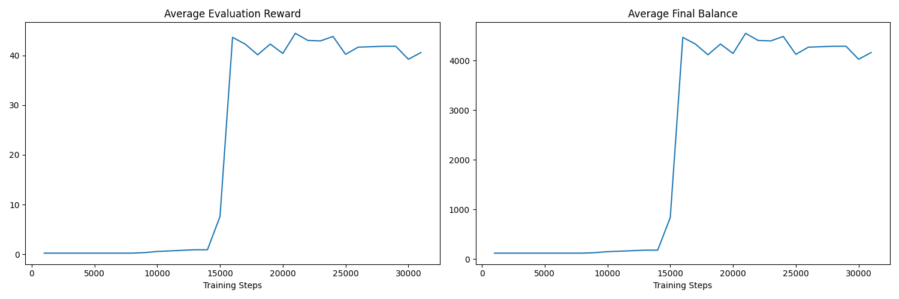
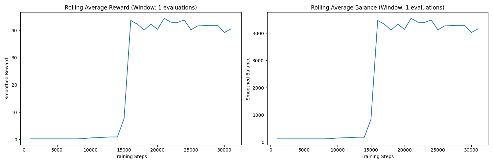

# Reinforced Gambler 🎰🤖

<p align="center">
  
  
  
  
</p>

<p align="center">
  A reinforcement learning algorithm designed to beat gambling scenarios. 🚀
</p>

---

## 📖 Project Overview

The **Reinforced Gambler** is a reinforcement learning agent trained to maximize its balance in a simulated gambling environment. It uses a **Deep Q-Network (DQN)** with **prioritized experience replay** and **mixed precision training** to learn the optimal strategy. The project includes **early stopping**, **performance monitoring**, and **automatic graph generation** for analyzing training progress.

This project was created as a prototype to compete against [PowerisTsutsun's Discord bot](https://github.com/PowerisTsutsun).

---

## 🎯 Key Features

- 🚀 **Deep Q-Network (DQN)**: Learns optimal strategies for maximizing rewards.
- 📊 **Prioritized Experience Replay**: Improves learning efficiency by focusing on important experiences.
- ⏳ **Early Stopping**: Automatically stops training if performance plateaus.
- 📈 **Graph Generation**: Produces graphs for analyzing training progress.
- 🤖 **Mixed Precision Training**: Speeds up training on GPUs.

---

## 📦 Installation

To get started, clone the repository and install the dependencies:

```bash
git clone https://github.com/Chungus1310/reinforced_gambler.git
cd reinforced_gambler
pip install -r requirements.txt
```

---

## 🚀 Usage

Train the agent by running the Jupyter Notebook:

```bash
jupyter notebook training.ipynb
```

Monitor training progress and view generated graphs:

- `training_progress.png`: Overall training metrics.
- `rolling_metrics.png`: Smoothed trends using rolling averages.

---

## 📊 Results

Here are some key metrics from the training process:

- 🏆 **Best Balance Achieved**: 4546.00
- 🎉 **Best Average Reward**: 44.46
- ⏱️ **Training Steps**: 31,000

Check out the generated graphs for more insights:




---

## 🛠️ Technologies Used

-  **Python**: The primary programming language.
-  **TensorFlow**: For building and training the DQN.
-  **Gym**: For creating the custom gambling environment.
-  **Reinforcement Learning**: For training the agent.

---

## 🤝 Contributing

Contributions are welcome! Please follow these steps:

1. Fork the repository.
2. Create a new branch for your feature/bugfix.
3. Submit a pull request with a detailed description of your changes.

---

## 📄 License

This project is licensed under the MIT License. See the [LICENSE](LICENSE) file for details.

---

<p align="center">
  Made with ❤️ by <a href="https://github.com/Chungus1310">Chun</a>
</p>
<p align="center">
  Inspired by <a href="https://github.com/PowerisTsutsun">PowerisTsutsun's Discord bot</a>
</p>

